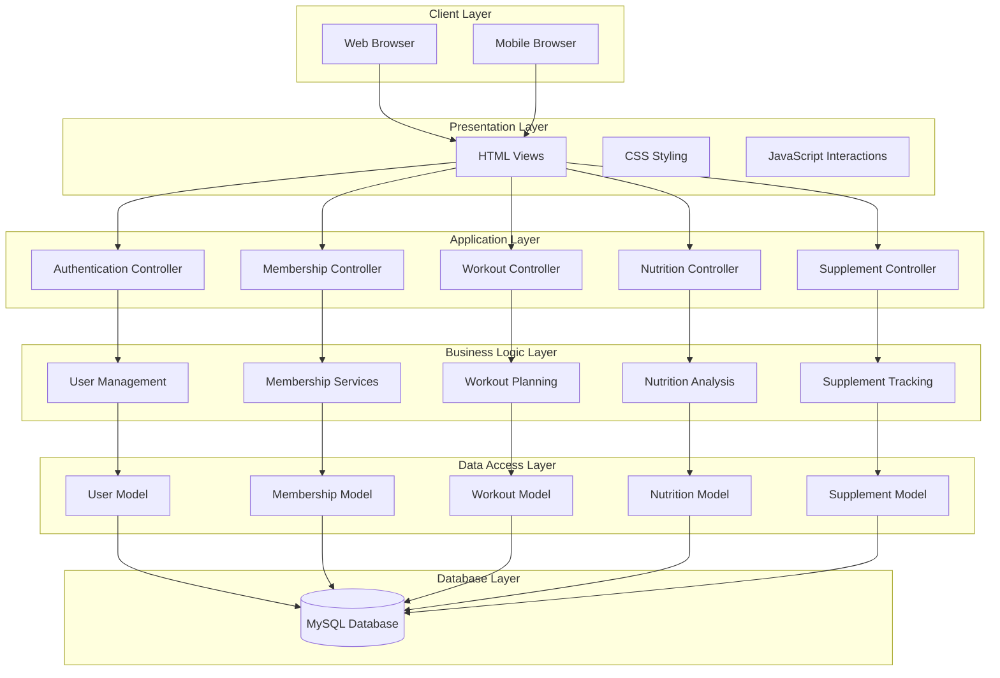
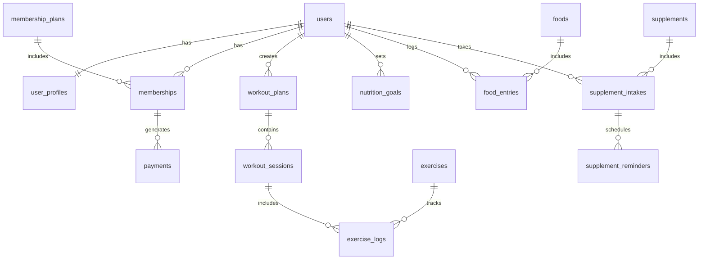

# Gym Membership and Workout Log System with Integrated Nutrition & Supplement Tracker - Development Plan

## Overview

This document outlines the comprehensive development plan for the Gym Membership and Workout Log System with Integrated Nutrition & Supplement Tracker. The system is designed as a web-based application using PHP for backend services and MySQL for data persistence, targeting gym administrators, trainers, and members within the gym's network environment.

### Current Status
- ✅ Database structure designed
- ✅ Basic folder structure established
- ✅ User authentication foundation implemented
- ⏳ Ready for next development phase

### System Scope and Limitations

#### Scope
- **Primary Users**: Gym administrators, trainers, and members
- **Core Functionality**: 
  - Gym membership management including member registration, profile updates, and membership status tracking
  - Workout routine creation and exercise logging for both trainers and members
  - Nutrition and supplement tracking with manual food intake and supplement usage recording
  - Web-based accessibility through modern browsers within gym's network
  - Database management of members, trainers, administrators, workout routines, and nutritional logs

#### System Limitations
- **Payment Processing**: No online payment gateway integration - membership fees handled physically at gym reception
- **Nutrition Input**: Manual entry only - no automated food recognition, barcode scanning, or AI-driven portion analysis
- **Hardware Integration**: No RFID access cards, biometric verification, or fitness wearables support
- **Platform Availability**: Web browser only - no dedicated mobile application
- **Network Dependency**: Requires stable internet connection within gym premises
- **Manual Measurements**: Members must measure and input food quantities manually (e.g., "5g of rice")

### Technology Stack
- **Backend**: PHP with object-oriented architecture
- **Database**: MySQL for data persistence
- **Frontend**: HTML/CSS/JavaScript for web interface
- **Deployment**: Web-based application for gym internal network

## Architecture

### System Architecture Overview



### Current Implementation Analysis

Based on your existing code structure:

| Component 		| Status 			| Files |
|-----------|--------|-------|
| Authentication | 	✅ Basic Implementation 	| `AuthController.php`, `User.php` |
| Database Connection | ✅ Implemented 			| `database.php` |
| Routing | 		✅ Basic Structure 		| `web.php` |
| Models | 		🔄 Partial (User only) 		| `User.php` |
| Controllers | 	🔄 Partial (Auth only) 		| `AuthController.php` |
| Views | 		❌ Not Implemented 		| - |
| Frontend Assets | 	❌ Empty Structure 		| `assets/` |

## Core Feature Development

### Phase 1: Foundation & User Management (Weeks 1-2)

#### 1.1 Enhanced User Management
```mermaid
classDiagram
    class User {
        +int user_id
        +string username
        +string email
        +string password_hash
        +string role
        +string first_name
        +string last_name
        +date created_at
        +date updated_at
        +register()
        +login()
        +updateProfile()
        +changePassword()
    }
    
    class UserProfile {
        +int profile_id
        +int user_id
        +date birth_date
        +string gender
        +float height
        +float weight
        +string fitness_goals
        +string medical_conditions
        +createProfile()
        +updateProfile()
    }
    
    User ||--|| UserProfile
```

#### 1.2 Session Management & Security
- Implement secure session handling
- Add CSRF protection
- Input validation and sanitization
- Password reset functionality

### Phase 2: Membership Management (Weeks 3-4)

#### 2.1 Membership System Architecture (No Payment Gateway)
```mermaid
classDiagram
    class MembershipPlan {
        +int plan_id
        +string plan_name
        +decimal price
        +int duration_months
        +string features
        +bool is_active
        +createPlan()
        +updatePlan()
    }
    
    class Membership {
        +int membership_id
        +int user_id
        +int plan_id
        +date start_date
        +date end_date
        +string status
        +decimal amount_due
        +string payment_status
        +assignMembership()
        +renewMembership()
        +checkExpiry()
        +markPaymentReceived()
    }
    
    class PaymentRecord {
        +int record_id
        +int membership_id
        +decimal amount
        +date payment_date
        +string received_by
        +string payment_method
        +string receipt_number
        +recordManualPayment()
        +generateReceipt()
    }
    
    MembershipPlan ||--o{ Membership
    Membership ||--o{ PaymentRecord
```

#### 2.2 Manual Payment Management Features
- Membership status display with payment due alerts
- Manual payment recording by reception staff
- Physical receipt generation and tracking
- Payment history for administrative purposes
- Membership renewal notifications (in-system only)

### Phase 3: Workout Tracking System (Weeks 5-7)

#### 3.1 Workout Management Architecture
```mermaid
classDiagram
    class Exercise {
        +int exercise_id
        +string exercise_name
        +string category
        +string muscle_groups
        +string equipment_needed
        +string instructions
        +string difficulty_level
        +addExercise()
        +updateExercise()
    }
    
    class WorkoutPlan {
        +int plan_id
        +int user_id
        +string plan_name
        +string goal_type
        +int duration_weeks
        +date created_at
        +createPlan()
        +updatePlan()
    }
    
    class WorkoutSession {
        +int session_id
        +int user_id
        +int plan_id
        +date workout_date
        +time duration
        +string notes
        +startSession()
        +endSession()
        +logExercise()
    }
    
    class ExerciseLog {
        +int log_id
        +int session_id
        +int exercise_id
        +int sets
        +int reps
        +float weight
        +time rest_time
        +string notes
        +logSet()
        +updateSet()
    }
    
    Exercise ||--o{ ExerciseLog
    WorkoutPlan ||--o{ WorkoutSession
    WorkoutSession ||--o{ ExerciseLog
```

#### 3.2 Workout Features
- Pre-built workout templates
- Custom workout creation
- Exercise library with instructions
- Progress tracking and analytics
- Workout history and reports

### Phase 4: Nutrition Tracking (Weeks 8-10)

#### 4.1 Nutrition System Design
```mermaid
classDiagram
    class Food {
        +int food_id
        +string food_name
        +string category
        +float calories_per_100g
        +float protein_per_100g
        +float carbs_per_100g
        +float fat_per_100g
        +float fiber_per_100g
        +addFood()
        +searchFood()
    }
    
    class MealPlan {
        +int plan_id
        +int user_id
        +string plan_name
        +int target_calories
        +float target_protein
        +float target_carbs
        +float target_fat
        +createPlan()
        +calculateMacros()
    }
    
    class FoodEntry {
        +int entry_id
        +int user_id
        +int food_id
        +date entry_date
        +string meal_type
        +float quantity
        +float calories_consumed
        +logFood()
        +updateEntry()
    }
    
    class NutritionGoal {
        +int goal_id
        +int user_id
        +int daily_calories
        +float protein_percentage
        +float carb_percentage
        +float fat_percentage
        +setGoals()
        +trackProgress()
    }
    
    Food ||--o{ FoodEntry
    MealPlan ||--o{ FoodEntry
    NutritionGoal ||--|| MealPlan
```

#### 4.2 Manual Nutrition Tracking Features
- **Manual Food Database**: Pre-populated food items with nutritional information per 100g
- **Manual Entry System**: Members input measured quantities (e.g., "150g chicken breast", "5g rice")
- **Meal Categorization**: Breakfast, lunch, dinner, and snack tracking
- **Daily Calorie and Macro Calculations**: Based on manual inputs
- **Progress Visualization**: Charts showing nutritional trends over time
- **Goal Setting**: Target calories and macronutrient ratios
- **Simple Recipe Storage**: Save frequently consumed meal combinations

**Note**: All nutritional data entry requires manual measurement and input by members. No automated food recognition or portion estimation features.

### Phase 5: Supplement Tracking (Weeks 11-12)

#### 5.1 Supplement Management
```mermaid
classDiagram
    class Supplement {
        +int supplement_id
        +string name
        +string brand
        +string category
        +string description
        +string benefits
        +string side_effects
        +addSupplement()
        +searchSupplement()
    }
    
    class SupplementIntake {
        +int intake_id
        +int user_id
        +int supplement_id
        +string dosage
        +string frequency
        +date start_date
        +date end_date
        +string notes
        +logIntake()
        +trackAdherence()
    }
    
    class SupplementReminder {
        +int reminder_id
        +int intake_id
        +time reminder_time
        +string frequency
        +bool is_active
        +setReminder()
        +sendNotification()
    }
    
    Supplement ||--o{ SupplementIntake
    SupplementIntake ||--o{ SupplementReminder
```

## Frontend Development Architecture

### Web-Based Interface Design
```
assets/
├── css/
│   ├── styles.css (Global styles for web interface)
│   ├── dashboard.css (Dashboard specific styling)
│   ├── workout.css (Workout pages styling)
│   ├── nutrition.css (Nutrition tracking pages)
│   └── responsive.css (Browser compatibility)
├── js/
│   ├── app.js (Main application logic)
│   ├── workout.js (Workout functionality)
│   ├── nutrition.js (Manual nutrition tracking)
│   ├── membership.js (Payment recording)
│   └── charts.js (Data visualization)
└── images/
    ├── icons/
    └── gym-branding/
```

### Browser-Based Page Templates

| Page Category | Templates | Access Level | Priority |
|---------------|-----------|--------------|----------|
| Authentication | login.php, register.php | All Users | High |
| Dashboard | member-dashboard.php, trainer-dashboard.php, admin-dashboard.php | Role-based | High |
| Membership | membership-status.php, payment-recording.php | Admin/Reception | High |
| Workouts | workout-plans.php, exercise-library.php, session-log.php | Members/Trainers | Medium |
| Nutrition | manual-food-entry.php, nutrition-goals.php, meal-history.php | Members | Medium |
| Supplements | supplement-tracker.php, intake-log.php | Members | Low |

### Web Interface Components
- Responsive navigation for different screen sizes
- Data visualization charts (Chart.js integration)
- Form validation with immediate feedback
- Modal dialogs for quick data entry
- Print-friendly receipt generation
- Offline-capable forms (with sync when connection restored)

**Note**: No mobile app development - all functionality accessible through web browsers only.

## API Endpoints Design

### Authentication Endpoints
| Endpoint | Method | Purpose |
|----------|--------|---------|
| `/api/auth/login` | POST | User authentication |
| `/api/auth/register` | POST | User registration |
| `/api/auth/logout` | POST | Session termination |
| `/api/auth/reset-password` | POST | Password reset |

### Core Feature Endpoints
| Module | Endpoints | Methods | Note |
|--------|-----------|---------|------|
| **Membership** | `/api/memberships`, `/api/plans`, `/api/payment-records` | GET, POST, PUT | Manual payment recording only |
| **Workouts** | `/api/workouts`, `/api/exercises`, `/api/sessions` | GET, POST, PUT, DELETE | Full CRUD operations |
| **Nutrition** | `/api/foods`, `/api/manual-entries`, `/api/nutrition-logs` | GET, POST, PUT, DELETE | Manual input required |
| **Supplements** | `/api/supplements`, `/api/intake`, `/api/logs` | GET, POST, PUT, DELETE | Manual tracking only |

## Database Schema Extensions

### Required Tables for Complete System



## Development Milestones

### Milestone 1: Enhanced Foundation (Week 2)
- ✅ Complete user authentication system
- ✅ Implement session management
- ✅ Create basic dashboard views
- ✅ Set up responsive CSS framework

### Milestone 2: Manual Membership Management (Week 4)
- ✅ Membership plan management system
- ✅ Manual payment recording interface for reception staff
- ✅ Member status dashboard (payment due alerts)
- ✅ Admin management panel for membership tracking

### Milestone 3: Workout System (Week 7)
- ✅ Exercise library implementation
- ✅ Workout plan creation and management
- ✅ Session logging functionality
- ✅ Progress tracking and analytics

### Milestone 4: Manual Nutrition Module (Week 10)
- ✅ Food database with nutritional information per 100g
- ✅ Manual food entry system with quantity measurement
- ✅ Calorie and macro calculation based on manual inputs
- ✅ Nutritional goal setting and progress tracking

### Milestone 5: Manual Supplement Tracking (Week 12)
- ✅ Supplement database with basic information
- ✅ Manual intake logging system
- ✅ Simple reminder system (web-based notifications only)
- ✅ Adherence tracking through manual entries

## Testing Strategy

### Unit Testing Framework
- **Backend**: PHPUnit for model and controller testing
- **Frontend**: Jest for JavaScript functionality
- **Database**: Test fixtures and seeders

### Integration Testing
- API endpoint testing with Postman/Newman
- Database transaction testing
- Session management testing
- File upload and validation testing

### User Acceptance Testing
- Member workflow testing
- Admin functionality validation
- Cross-browser compatibility
- Mobile responsiveness verification

## Technology Integration

### Third-Party Services (Limited Integration)
| Service | Purpose | Implementation | Limitation |
|---------|---------|----------------|------------|
| **Chart.js** | Data visualization | Progress charts, analytics | Web browser only |
| **jQuery** | DOM manipulation | Form handling, AJAX | No mobile optimization |
| **Bootstrap** | UI framework | Responsive web design | Browser-based responsive only |
| **PHPMailer** | Email services | Password reset notifications | Internal network only |

### Security Considerations
- SQL injection prevention (prepared statements)
- XSS protection (input sanitization)
- CSRF token implementation
- Secure password hashing (bcrypt)
- Session security for gym network environment
- Manual data validation for nutrition entries

### Performance Optimization (Web-Based)
- Database query optimization for gym network
- Image compression for web delivery
- CSS/JS minification for faster loading
- Local caching strategies for static content
- Progressive loading for large exercise/food databases
- Offline-capable forms with sync capability